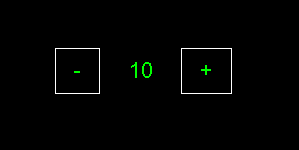

JS Counter

> Counter made in JS, the button and display part was made using DOM's manipulation.
The color of the counter changes depending on the positivity and negativity of the number displayed.
Zero's color in white.
Positive numbers' color is green.
Negative numbers' color is yellow.

Value at zero.

Value at ten.

Value at negative ten.

## Installation

No installation required.

## Usage example

You like playing with numbers (?)

## Development setup

No setup required.

## Release History

* 0.0.1
    * Everything runs smoothly.

## Meta

Alessandro Ponton – [@itsabtomal](https://x.com/itsabtomal) – alessandroponton@hotmail.com - abtomal.github.io

[https://abtomal.github.io](https://abtomal.github.io)

"# jscounter" 
"# jscounter" 
